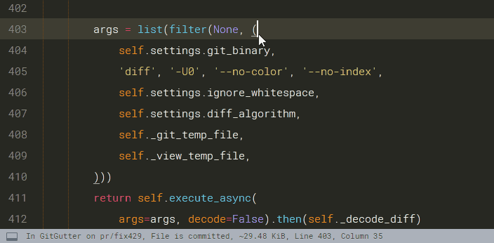

# GitGutter

A [Sublime Text](http://www.sublimetext.com) plug-in to show information about files in a git repository:

1. _Gutter Icons_ indicating inserted, modified or deleted lines
2. _Diff Popup_ with details about modified lines
3. _Status Bar Text_ with information about file and repository

and provides some commands like:

1. _Goto Change_ to navigate between modified lines
2. _Copy from Commit_ to copy the original content from the commit
3. _Revert to Commit_ to revert a modified hunk to the original state in a commit


## Installation

### By Package Control

1. Download & Install **`Sublime Text 3`** (https://www.sublimetext.com/3)
1. Go to the menu **`Tools -> Install Package Control`**, then,
   wait few seconds until the installation finishes up
1. Now,
   Go to the menu **`Preferences -> Package Control`**
1. Type **`Add Channel`** on the opened quick panel and press <kbd>Enter</kbd>
1. Then,
   input the following address and press <kbd>Enter</kbd>
   ```
   https://raw.githubusercontent.com/evandrocoan/StudioChannel/master/channel.json
   ```
1. Go to the menu **`Tools -> Command Palette...
   (Ctrl+Shift+P)`**
1. Type **`Preferences:
   Package Control Settings – User`** on the opened quick panel and press <kbd>Enter</kbd>
1. Then,
   find the following setting on your **`Package Control.sublime-settings`** file:
   ```js
       "channels":
       [
           "https://packagecontrol.io/channel_v3.json",
           "https://raw.githubusercontent.com/evandrocoan/StudioChannel/master/channel.json",
       ],
   ```
1. And,
   change it to the following, i.e.,
   put the **`https://raw.githubusercontent...`** line as first:
   ```js
       "channels":
       [
           "https://raw.githubusercontent.com/evandrocoan/StudioChannel/master/channel.json",
           "https://packagecontrol.io/channel_v3.json",
       ],
   ```
   * The **`https://raw.githubusercontent...`** line must to be added before the **`https://packagecontrol.io...`** one, otherwise,
     you will not install this forked version of the package,
     but the original available on the Package Control default channel **`https://packagecontrol.io...`**
1. Now,
   go to the menu **`Preferences -> Package Control`**
1. Type **`Install Package`** on the opened quick panel and press <kbd>Enter</kbd>
1. Then,
search for **`GitGutter`** and press <kbd>Enter</kbd>

See also:
1. [ITE - Integrated Toolset Environment](https://github.com/evandrocoan/ITE)
1. [Package control docs](https://packagecontrol.io/docs/usage) for details.


## Gutter Icons & Status Bar Text



The icons of the default theme have the following meaning:

 Icon          | Description
:-------------:|-------------------------
![inserted][]  | inserted line
![changed][]   | modified line
![deleted][]   | deleted region borders
![ignored][]   | ignored file
![untracked][] | untracked file

[changed]: <docs/assets/images/gutter_changed.png>
[deleted]: <docs/assets/images/gutter_deleted.png>
[ignored]: <docs/assets/images/gutter_ignored.png>
[inserted]: <docs/assets/images/gutter_inserted.png>
[untracked]: <docs/assets/images/gutter_untracked.png>


## Diff Popup

The diff popup shows the original content from the commit or the differences between it and the working content.

ⓘ _requires Sublime Text 3 Build 3124+ and mdpopups 2.0.0+_


The toolbar provides some commands to interact with or modify the changes.

 symbol | meaning of the symbol
 :-----:| ---------------------------------------
 ×      | close the popup
 ⤒      | goto to first change
 ↑      | goto to previous change
 ↓      | goto to next change
 ≈, ≉   | enable/disable difference highlighting
 ⎘      | copy the original content from the commit
 ⟲      | revert a modified hunk to the original state in a commit


## Documentaion

Please read https://jisaacks.github.io/GitGutter/ for detailed information about

- [Installation](https://jisaacks.github.io/GitGutter/install)
- [Usage](https://jisaacks.github.io/GitGutter/usage)
- [Settings](https://jisaacks.github.io/GitGutter/settings)
- [Troubleshooting](https://jisaacks.github.io/GitGutter/troubleshooting)
